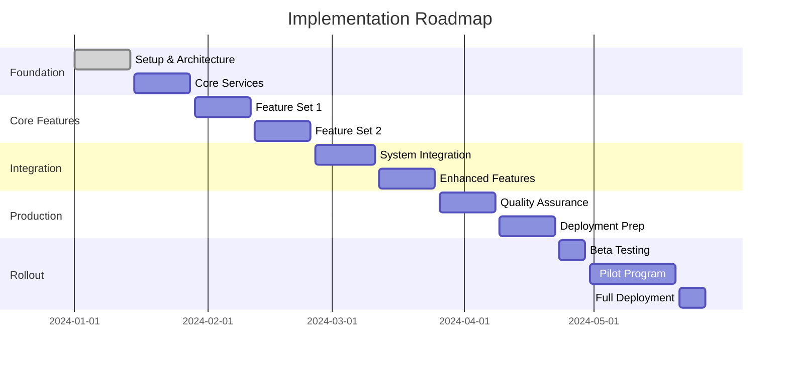

# Implementation Roadmap Template

## Project Overview

**Project Name**: [System/Module Name]
**Project Duration**: [Start Date] - [End Date]
**Total Effort**: [Estimated person-hours/days]
**Team Size**: [Number of team members]
**Budget**: [If applicable]

## Executive Summary

### Project Goals

- [Primary goal 1]
- [Primary goal 2]
- [Primary goal 3]

### Success Criteria

- [Measurable success criterion 1]
- [Measurable success criterion 2]
- [Measurable success criterion 3]

### Key Deliverables

- [Major deliverable 1]
- [Major deliverable 2]
- [Major deliverable 3]

## MVP (Minimum Viable Product) Definition

### Core Functionality

The MVP will include only the most essential features required for the system to function and provide value:

#### Must-Have Features (MVP Release)

1. **[Feature 1]**

   - **Description**: [Brief description]
   - **User Value**: [Why this is essential]
   - **Effort**: [Estimated hours/days]

2. **[Feature 2]**

   - **Description**: [Brief description]
   - **User Value**: [Why this is essential]
   - **Effort**: [Estimated hours/days]

3. **[Feature 3]**
   - **Description**: [Brief description]
   - **User Value**: [Why this is essential]
   - **Effort**: [Estimated hours/days]

### MVP Success Metrics

- [Specific measurable goal 1]
- [Specific measurable goal 2]
- [Specific measurable goal 3]

### MVP Timeline

- **Development Start**: [Date]
- **Feature Complete**: [Date]
- **Testing Complete**: [Date]
- **MVP Release**: [Date]

## Implementation Phases

### Phase 1: Foundation (Weeks 1-4)

**Objective**: Establish technical foundation and core infrastructure

#### Week 1-2: Setup and Architecture

- [ ] Development environment setup
- [ ] Database schema design and implementation
- [ ] Basic authentication and authorization framework
- [ ] CI/CD pipeline configuration
- [ ] Initial deployment to staging environment

**Deliverables**:

- Working development environment
- Database structure implemented
- Basic authentication system
- Automated build and deployment pipeline

**SME Involvement**:

- Review database schema
- Validate authentication approach
- Approve deployment strategy

#### Week 3-4: Core Services

- [ ] Implement core microservice interactions
- [ ] Set up monitoring and logging
- [ ] Implement basic API endpoints
- [ ] Create foundation for frontend application
- [ ] Initial security implementation

**Deliverables**:

- Core API functionality
- Frontend application skeleton
- Monitoring and logging systems
- Security framework

**SME Involvement**:

- Review API design
- Validate security approach
- Test basic functionality

### Phase 2: Core Features (Weeks 5-8)

**Objective**: Implement essential business functionality

#### Week 5-6: [Core Feature Set 1]

- [ ] [Specific feature implementation]
- [ ] [Related feature implementation]
- [ ] Unit testing for core features
- [ ] Integration testing setup
- [ ] Initial UI/UX implementation

**Deliverables**:

- [Feature 1] fully implemented and tested
- [Feature 2] fully implemented and tested
- Comprehensive test suite
- Initial user interface

**SME Involvement**:

- Daily feature demos
- Feedback on functionality
- User experience validation

#### Week 7-8: [Core Feature Set 2]

- [ ] [Additional core feature implementation]
- [ ] [Another core feature implementation]
- [ ] Performance optimization
- [ ] Error handling and validation
- [ ] Documentation updates

**Deliverables**:

- [Feature 3] fully implemented and tested
- [Feature 4] fully implemented and tested
- Performance benchmarks met
- Updated documentation

**SME Involvement**:

- Feature acceptance testing
- Performance validation
- Documentation review

### Phase 3: Integration and Enhancement (Weeks 9-12)

**Objective**: Integrate with existing systems and add enhanced functionality

#### Week 9-10: System Integration

- [ ] Integration with Core microservice
- [ ] Integration with Statutory microservice
- [ ] Data synchronization implementation
- [ ] Cross-service testing
- [ ] Security hardening

**Deliverables**:

- Full system integration
- Data flow validation
- Comprehensive security testing
- Performance under integrated load

**SME Involvement**:

- End-to-end workflow testing
- Data accuracy validation
- Integration approval

#### Week 11-12: Enhanced Features

- [ ] [Should-have feature 1]
- [ ] [Should-have feature 2]
- [ ] Advanced error handling
- [ ] User experience improvements
- [ ] Performance optimization

**Deliverables**:

- Enhanced functionality implemented
- Improved user experience
- Optimized performance
- Complete feature set for release

**SME Involvement**:

- Enhanced feature validation
- User experience approval
- Final acceptance testing

### Phase 4: Production Readiness (Weeks 13-16)

**Objective**: Prepare system for production deployment

#### Week 13-14: Quality Assurance

- [ ] Comprehensive testing (all test types)
- [ ] Security audit and penetration testing
- [ ] Performance testing under load
- [ ] Accessibility testing and compliance
- [ ] Browser compatibility testing

**Deliverables**:

- Complete test coverage
- Security clearance
- Performance validation
- Accessibility compliance
- Cross-browser compatibility

**SME Involvement**:

- User acceptance testing
- Final functionality approval
- Training material review

#### Week 15-16: Deployment Preparation

- [ ] Production environment setup
- [ ] Data migration planning and testing
- [ ] Backup and recovery procedures
- [ ] Monitoring and alerting configuration
- [ ] Documentation finalization

**Deliverables**:

- Production-ready environment
- Tested migration procedures
- Operational procedures
- Complete documentation
- Training materials

**SME Involvement**:

- Production readiness approval
- Migration plan approval
- Training delivery

## Feature Rollout Strategy

### Rollout Approach: Phased Deployment

#### Phase 1: Internal Beta (Week 17)

- **Audience**: Development team and key SMEs
- **Features**: All MVP features
- **Duration**: 1 week
- **Success Criteria**:
  - No critical bugs
  - Core workflows function correctly
  - Performance meets baseline requirements

#### Phase 2: Limited Pilot (Week 18-19)

- **Audience**: Selected user group (20-30 users)
- **Features**: All implemented features
- **Duration**: 2 weeks
- **Success Criteria**:
  - User satisfaction >80%
  - <5 support tickets per day
  - System uptime >99%

#### Phase 3: Gradual Rollout (Week 20-22)

- **Audience**: Expand to 50% of user base
- **Features**: All features
- **Duration**: 3 weeks
- **Success Criteria**:
  - User satisfaction >85%
  - Performance meets all benchmarks
  - Support load manageable

#### Phase 4: Full Deployment (Week 23)

- **Audience**: All users
- **Features**: Complete system
- **Duration**: Ongoing
- **Success Criteria**:
  - User satisfaction >90%
  - All performance targets met
  - Smooth operational transition

### Feature Flags Strategy

#### Controlled Feature Rollout

- **Implementation**: Feature flags for all major features
- **Benefits**:
  - Ability to quickly disable problematic features
  - Gradual exposure of features to user base
  - A/B testing capabilities
  - Risk mitigation during deployment

#### Feature Flag Management

- **Feature 1**: [Description and rollout plan]
- **Feature 2**: [Description and rollout plan]
- **Feature 3**: [Description and rollout plan]

## Pilot Testing Plan

### Pilot Program Structure

#### Pilot Goals

- Validate system functionality in real-world conditions
- Identify and resolve usability issues
- Gather user feedback for improvements
- Test system performance under realistic load

#### Pilot Participants

- **Primary Users**: [Number and description]
- **Secondary Users**: [Number and description]
- **SME Representatives**: [Number and roles]
- **Technical Support**: [Support team members]

#### Pilot Environment

- **Infrastructure**: Production-like environment
- **Data**: Realistic test data (anonymized if necessary)
- **Monitoring**: Comprehensive logging and monitoring
- **Support**: Dedicated support channel for pilot users

### Pilot Phases

#### Phase 1: Controlled Testing (Week 1)

- **Participants**: 5-10 key users
- **Focus**: Core functionality validation
- **Activities**:
  - Guided walkthrough of key features
  - Structured testing scenarios
  - Daily feedback sessions
  - Issue tracking and resolution

#### Phase 2: Expanded Testing (Week 2-3)

- **Participants**: 20-30 users
- **Focus**: Real-world usage patterns
- **Activities**:
  - Natural usage patterns
  - Performance monitoring
  - Weekly feedback sessions
  - User experience improvements

#### Phase 3: Full Pilot (Week 4-6)

- **Participants**: Full pilot group
- **Focus**: Production readiness validation
- **Activities**:
  - Complete business process execution
  - Stress testing under realistic load
  - Final adjustments and improvements
  - Go/no-go decision for full rollout

### Success Criteria for Pilot

#### Functional Success

- [ ] All core features work as expected
- [ ] No critical or high-priority bugs
- [ ] All business processes can be completed
- [ ] Integration with existing systems works correctly

#### Performance Success

- [ ] Response times meet defined benchmarks
- [ ] System handles expected user load
- [ ] No significant performance degradation
- [ ] Resource utilization within acceptable limits

#### User Acceptance Success

- [ ] User satisfaction score >85%
- [ ] Task completion rate >95%
- [ ] Error rate <2%
- [ ] Support ticket volume manageable

## Rollback Procedures

### Rollback Triggers

- **Critical Bug**: System-breaking functionality
- **Performance Issues**: Unacceptable performance degradation
- **Data Integrity**: Risk of data loss or corruption
- **Security Breach**: Identified security vulnerabilities
- **User Rejection**: Widespread user dissatisfaction

### Rollback Process

#### Immediate Response (0-2 hours)

1. **Assessment**: Evaluate severity and impact
2. **Decision**: Go/no-go on rollback
3. **Communication**: Notify all stakeholders
4. **Action**: Execute rollback procedures

#### Rollback Execution (2-4 hours)

1. **System Shutdown**: Gracefully stop new system
2. **Data Backup**: Secure any new data
3. **System Restoration**: Restore previous version
4. **Data Migration**: Migrate critical new data back
5. **Validation**: Verify system functionality

#### Post-Rollback Activities (4-24 hours)

1. **Root Cause Analysis**: Identify cause of failure
2. **Fix Development**: Create fixes for identified issues
3. **Testing**: Comprehensive testing of fixes
4. **Communication**: Update stakeholders on status
5. **Re-deployment Planning**: Plan for next deployment attempt

### Rollback Testing

- **Regular Testing**: Monthly rollback procedure testing
- **Documentation**: Detailed rollback procedures documented
- **Training**: Team trained on rollback procedures
- **Automation**: Automated rollback capabilities where possible

## Timeline and Milestones

### Master Timeline

### Key Milestones

| Milestone            | Date   | Deliverable                                       | Success Criteria                                    |
| -------------------- | ------ | ------------------------------------------------- | --------------------------------------------------- |
| Foundation Complete  | [Date] | Working development environment and core services | All setup tasks complete, basic functionality works |
| MVP Feature Complete | [Date] | All must-have features implemented                | All MVP features work, pass testing                 |
| Integration Complete | [Date] | System fully integrated with existing services    | End-to-end workflows function correctly             |
| Production Ready     | [Date] | System ready for deployment                       | All quality gates passed, SME approval              |
| Pilot Complete       | [Date] | Successful pilot program                          | Pilot success criteria met, go-live approval        |
| Full Deployment      | [Date] | System live for all users                         | All users migrated, system operational              |

### Risk Mitigation Timeline

- **Week 4**: Early integration testing to identify issues
- **Week 8**: Mid-project review and course correction
- **Week 12**: Pre-production readiness assessment
- **Week 16**: Final go/no-go decision point
- **Week 20**: Rollback decision point if needed

## Resource Allocation

### Team Structure

#### Core Development Team

- **Technical Lead** (1.0 FTE): Architecture, code review, technical decisions
- **Senior Developer** (1.0 FTE): Core feature development
- **Developer** (2.0 FTE): Feature development and testing
- **Frontend Developer** (1.0 FTE): UI/UX implementation
- **QA Engineer** (0.5 FTE): Testing and quality assurance

#### Supporting Roles

- **Project Manager** (0.5 FTE): Project coordination and management
- **DevOps Engineer** (0.25 FTE): Infrastructure and deployment
- **UX Designer** (0.25 FTE): User experience design
- **Technical Writer** (0.25 FTE): Documentation

#### SME Involvement

- **Primary SME** (0.5 FTE): Requirements validation and testing
- **Secondary SMEs** (0.25 FTE each): Specialized domain knowledge
- **End User Representatives** (0.1 FTE): User testing and feedback

### Budget Allocation (if applicable)

#### Personnel Costs

- Development Team: [Cost]
- SME Time: [Cost]
- Support Staff: [Cost]

#### Infrastructure Costs

- Development Environment: [Cost]
- Testing Environment: [Cost]
- Production Environment: [Cost]

#### Other Costs

- Third-party Tools/Licenses: [Cost]
- Training and Documentation: [Cost]
- Contingency (10%): [Cost]

## Success Metrics and KPIs

### Development KPIs

- **Velocity**: Story points completed per sprint
- **Quality**: Defect rate per feature
- **Schedule**: Percentage of milestones met on time
- **Budget**: Percentage variance from planned budget

### User Experience KPIs

- **Adoption Rate**: Percentage of users actively using new system
- **User Satisfaction**: Score from user surveys
- **Task Completion Rate**: Percentage of users successfully completing tasks
- **Support Tickets**: Number and severity of user issues

### Technical KPIs

- **Performance**: Response times and throughput metrics
- **Reliability**: System uptime and availability
- **Security**: Number of security incidents
- **Maintainability**: Code quality metrics

### Business KPIs

- **ROI**: Return on investment from new system
- **Process Efficiency**: Time savings in business processes
- **Data Quality**: Accuracy and completeness of data
- **Compliance**: Level of regulatory compliance achieved

## Communication Plan

### Regular Updates

- **Daily**: Team standups and progress updates
- **Weekly**: Stakeholder status reports
- **Bi-weekly**: SME demos and feedback sessions
- **Monthly**: Steering committee updates

### Milestone Communications

- **Milestone Achievement**: Formal notification to all stakeholders
- **Risk Escalation**: Immediate communication of significant risks
- **Go/No-Go Decisions**: Formal decision communication process
- **Issue Resolution**: Regular updates on critical issue status

### Final Deliverables

- **System Documentation**: Complete technical and user documentation
- **Training Materials**: User guides and training programs
- **Operational Procedures**: Support and maintenance procedures
- **Project Closure Report**: Lessons learned and recommendations
