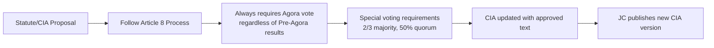

# Article 8: Proposals - Process Flow Diagram

## Overview

This diagram visualizes the proposal submission and voting process as outlined in Article 8 of the regulations.

```mermaid
graph TD
    Start([Start: Proposal Idea]) --> JC_Announce[Juridical Commission announces<br/>submission means & deadlines<br/>≥75 days before Agora]

    JC_Announce --> Draft[Submit Draft Proposal<br/>≥45 days before Agora<br/>Must include:<br/>- Specific procedure<br/>- Idea how to address<br/>- Motivation]

    Draft --> Publish_Draft[JC publishes draft<br/>for feedback collection]

    Publish_Draft --> Final[Submit Final Proposal<br/>≥30 days before Agora]

    Final --> JC_Publish[JC publishes all<br/>submitted proposals<br/>after final deadline]

    JC_Publish --> Agenda_Include[Proposals included<br/>in Agenda]

    Agenda_Include --> Month_Before{Within month before Agora}
    Month_Before -->|Changes needed| Consult_JC[Proposer can change<br/>only in consultation<br/>with JC]
    Month_Before -->|No changes| Check_Exclusion

    Consult_JC --> Agenda_Publish[Published with<br/>Agora Agenda]

    Agenda_Publish --> Check_Exclusion{≥5 antennae request<br/>exclusion from<br/>Pre-Agora Voting?}

    Check_Exclusion -->|Yes, ≥1 day before<br/>Pre-Agora Voting| Skip_PreVoting[Skip Pre-Agora Voting<br/>→ Vote at Agora]
    Check_Exclusion -->|No| Pre_Voting

    Pre_Voting[Pre-Agora Voting<br/>Days 14-9 before Agora<br/>Online voting<br/>50% quorum<br/>Qualified majority]

    Pre_Voting --> Pre_Results{Pre-Agora<br/>Voting Result}

    Pre_Results -->|Approved| Binding_Result[Result is binding<br/>Published immediately<br/>Shows how each member voted]
    Pre_Results -->|Rejected| Agora_Vote[New vote during<br/>Agora itself]

    Binding_Result --> Amendment_Check{Amendment submitted<br/>≥5 days before Agora?}
    Amendment_Check -->|Yes| Agora_Vote
    Amendment_Check -->|No| Statute_Check{Concerns Statutes or<br/>Convention d'Adhésion?}

    Statute_Check -->|Yes| Agora_Vote
    Statute_Check -->|No| Final_Approved[Proposal Approved<br/>No Agora vote needed]

    Skip_PreVoting --> Agora_Vote
    Agora_Vote --> Prytanium[Discussed in Prytanium<br/>- Presented by proposer<br/>- Discussion phase<br/>- Amendment procedure<br/>- Final vote by delegates]

    Prytanium --> Statute_Vote_Check{Is this a Statute or<br/>Convention d'Adhésion<br/>modification?}

    Statute_Vote_Check -->|Yes| Statute_Agora_Vote[Agora Vote<br/>2/3 majority required<br/>50% quorum of Ordinary Members]
    Statute_Vote_Check -->|No| Regular_Agora_Vote[Regular Agora Vote<br/>Standard majority]

    Statute_Agora_Vote --> Statute_Result{Vote Result}
    Regular_Agora_Vote --> Agora_Result{Vote Result}

    Statute_Result -->|Approved| CIA_Update[CIA Updated with<br/>approved text]
    Statute_Result -->|Rejected| Final_Rejected[Proposal Rejected]

    CIA_Update --> JC_Publish_CIA[JC publishes new<br/>version of CIA<br/>after Agora]
    JC_Publish_CIA --> Final_Approved

    Agora_Result -->|Approved| Final_Approved
    Agora_Result -->|Rejected| Final_Rejected[Proposal Rejected]

    %% Special case for Agora removal
    Agenda_Include -.->|Qualified majority| Remove_Proposal[Agora may remove<br/>proposals from agenda]
    Remove_Proposal --> Final_Rejected

    %% Styling
    classDef process fill:#e1f5fe
    classDef decision fill:#fff3e0
    classDef result fill:#e8f5e8
    classDef rejection fill:#ffebee

    class Draft,Final,Pre_Voting,Prytanium process
    class Check_Exclusion,Pre_Results,Amendment_Check,Statute_Check,Agora_Result,Statute_Vote_Check,Statute_Result decision
    class Final_Approved,CIA_Update,JC_Publish_CIA result
    class Final_Rejected rejection
```

## Key Timelines

```mermaid
gantt
    title Proposal Timeline (relative to Agora)
    dateFormat X
    axisFormat %d days

    section Preparation
    JC announces deadlines           :milestone, m1, -75, 0d

    section Draft Phase
    Draft submission deadline        :milestone, m2, -45, 0d
    Draft publication & feedback     :active, draft, -45, -30

    section Final Phase
    Final submission deadline        :milestone, m3, -30, 0d
    JC publishes all proposals       :publish, -30, -28
    Proposals in agenda              :agenda, -28, -14
    Consultation period              :consult, -30, -14

    section Pre-Agora Voting
    Exclusion request deadline       :milestone, m4, -15, 0d
    Pre-Agora voting period          :crit, prevote, -14, -9
    Results publication              :milestone, m5, -9, 0d

    section Amendment Phase
    Amendment deadline               :milestone, m6, -5, 0d

    section Agora
    Agora event                      :milestone, agora, 0, 0d

    section Post-Agora (CIA Updates)
    CIA update process               :update, 1, 7
    JC publishes new CIA             :milestone, m7, 7, 0d
```

## Process Notes

### Key Decision Points:

1. **Pre-Agora Voting Exclusion**: ≥5 antennae can request exclusion ≥1 day before Pre-Agora Voting
2. **Amendment Impact**: Any amendment ≥5 days before Agora triggers new vote at Agora
3. **Statute/Convention Proposals**: Always require Agora vote regardless of Pre-Agora results
4. **Rejection Handling**: Pre-Agora rejection automatically triggers Agora vote

### Voting Bodies:

- **Pre-Agora Voting**: Delegates of upcoming Agora (50% quorum, qualified majority)
- **Agora Voting (Regular)**: Delegates in Prytanium sessions (standard majority)
- **Agora Voting (Statute/CIA)**: All Ordinary Members (2/3 majority, 50% quorum)
- **Agenda Removal**: Full Agora (qualified majority)

### Prytanium Process:

- Led by person appointed by Chairpersons (not proposer or Comité Directeur member)
- Follows Working Format of the Agora (Article 17(5))
- Includes presentation, discussion, amendment procedure, and voting
- Only delegates have voting rights (others can attend but not vote)

## Article 36: Statute and CIA Modifications

### Special Requirements for Statute/CIA Changes:

**Submission Requirements (Article 36):**

- Must be submitted to Secretary General, Comité Directeur, and Juridical Commission
- Minimum 30 days before Agora (same as regular proposals)
- Must be included in the agenda

**Voting Requirements:**

- **Majority**: 2/3 majority (instead of standard qualified majority)
- **Quorum**: 50% of Ordinary Members of AEGEE-Europe
- **Voting Body**: All Ordinary Members (not just delegates)

**Post-Approval Process:**

1. **CIA Update**: The Convention d'Adhésion is updated with the approved text
2. **Publication**: JC publishes the new version of the CIA after the Agora

### Integration with Article 8 Process:

**Key Differences from Regular Proposals:**

- Cannot be fully approved through Pre-Agora Voting (always require Agora vote)
- Higher majority threshold (2/3 vs qualified majority)
- Different voting body (all Ordinary Members vs delegates only)
- Mandatory post-approval CIA update and publication process
