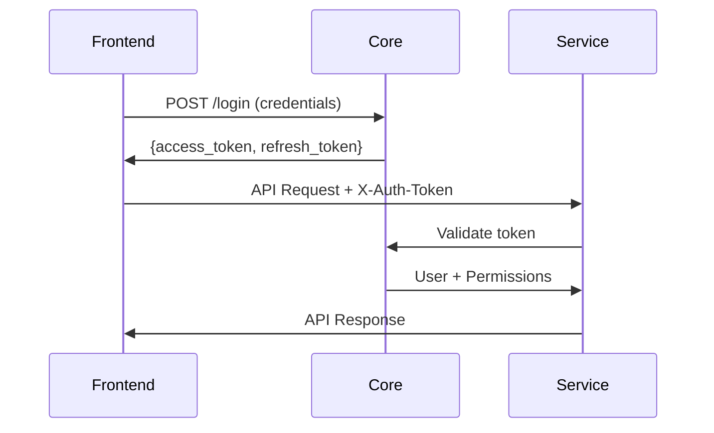

# Authentication and Permissions System

## Overview

The MyAEGEE platform implements a sophisticated Role-Based Access Control (RBAC) system centered around the concept of "circles" within "bodies" (organizations). This document details the authentication and authorization mechanisms used across all microservices.

## Authentication Architecture

### JWT Token-Based System

The platform uses a dual-token approach for authentication:

**Token Types:**

1. **Access Token**: Short-lived (15 minutes), contains user ID and basic claims
2. **Refresh Token**: Long-lived (30 days), used to obtain new access tokens

**Token Flow:**



### Token Structure

**Access Token Payload:**

```json
{
  "sub": "user_id",
  "iat": 1692547200,
  "exp": 1692548100,
  "type": "access",
  "user": {
    "id": 123,
    "email": "user@example.com",
    "first_name": "John",
    "last_name": "Doe"
  }
}
```

**Refresh Token Payload:**

```json
{
  "sub": "user_id",
  "iat": 1692547200,
  "exp": 1695139200,
  "type": "refresh"
}
```

## Permission System Architecture

### Core Concepts

**Bodies**: Organizations within AEGEE (locals, working groups, etc.)

- Each body has a unique identifier
- Bodies can have parent-child relationships
- Bodies contain circles for organizing members

**Circles**: Functional groups within bodies

- Technical circles (IT team, Finance team, etc.)
- Administrative circles (Board, Supervisory Committee, etc.)
- Hierarchical structure with parent-child relationships

**Permissions**: Action-object combinations with scope

- Format: `scope:action:object`
- Scopes: `global`, `local`, `join_request`
- Actions: `view`, `edit`, `create`, `delete`, `manage`, etc.
- Objects: `user`, `event`, `proposal`, `amendment`, etc.

### Permission Scope Hierarchy

**Permission Priority (highest to lowest):**

1. **Global Permissions**: `global:edit:user`

   - Apply across the entire system
   - Typically for system administrators
   - Override all other permissions

2. **Local Permissions**: `local:edit:user`

   - Apply within specific bodies/circles
   - Most common permission type
   - Scoped to user's membership context

3. **Join Request Permissions**: `join_request:edit:user`
   - Apply to join request processes
   - Limited scope for application management
   - Lowest priority

### Circle-Based Permissions

**Circle Membership Structure:**

```typescript
interface CircleMembership {
  user_id: number;
  circle_id: number;
  start_date: Date;
  end_date?: Date;
  position?: string;
}

interface Circle {
  id: number;
  name: string;
  description: string;
  body_id: number;
  parent_circle_id?: number;
  permissions: CirclePermission[];
}

interface CirclePermission {
  circle_id: number;
  permission_id: number;
  filters?: Record<string, any>;
}
```

**Permission Inheritance:**

- Users inherit permissions from all circles they belong to
- Child circles inherit permissions from parent circles
- Permission filters can restrict scope within inherited permissions

### Permission Resolution Algorithm

**PermissionsManager Class:**

```javascript
class PermissionsManager {
  constructor(user) {
    this.user = user;
    this.permissions = [];
    this.permissionsMap = {};
    this.circles = [];
    this.circlesMap = {};
  }

  // Resolve permission keys with scope fallback
  static getPermissionKeys(combined) {
    const combinedSplit = combined.split(":");
    if (combinedSplit.length === 2) {
      return [
        "global:" + combined,
        "local:" + combined,
        "join_request:" + combined,
      ];
    }
    return [combined];
  }

  // Check if user has permission
  hasPermission(permission) {
    const keys = PermissionsManager.getPermissionKeys(permission);
    return keys.some((key) => this.permissionsMap[key]);
  }

  // Get filters for data access control
  getPermissionFilters(permission) {
    const keys = PermissionsManager.getPermissionKeys(permission);
    for (const key of keys) {
      if (this.permissionsMap[key]) {
        return this.permissionsMap[key].filters?.length > 0
          ? this.permissionsMap[key].filters
          : undefined;
      }
    }
    return undefined;
  }

  // Resolve indirect circle relationships
  getIndirectChildCircles(circleId) {
    const directChildCirclesIds = this.circles
      .filter((circle) => circle.parent_circle_id === circleId)
      .map((circle) => circle.id);

    if (!directChildCirclesIds.length) {
      return [];
    }

    for (const id of directChildCirclesIds) {
      directChildCirclesIds.push(...this.getIndirectChildCircles(id));
    }

    return directChildCirclesIds;
  }

  // Resolve parent circle hierarchy
  getIndirectParentCircles(circleId) {
    const circlesArray = [circleId];
    let currentCircleId = circleId;

    while (this.circlesMap[currentCircleId].parent_circle_id) {
      currentCircleId = this.circlesMap[currentCircleId].parent_circle_id;
      circlesArray.push(currentCircleId);
    }

    return circlesArray;
  }
}
```

## Inter-Service Authentication

### Service-to-Service Communication

**Standard Authentication Headers:**

```javascript
{
    'X-Requested-With': 'XMLHttpRequest',
    'X-Auth-Token': token,           // User's access token
    'X-Service': 'service-name',     // Calling service identifier
    'Content-Type': 'application/json'
}
```

**Authentication Middleware Pattern:**

```javascript
exports.authenticateUser = async (req, res, next) => {
  try {
    // Query core service for user and permissions
    const [userBody, permissionsBody] = await Promise.all([
      coreService.getMyProfile(req),
      coreService.getMyPermissions(req),
    ]);

    // Validate responses
    if (!userBody.success || !permissionsBody.success) {
      return handleAuthError(res, userBody, permissionsBody);
    }

    // Attach user and permissions to request
    req.user = userBody.data;
    req.corePermissions = permissionsBody.data;
    req.permissions = helpers.getPermissions(req.user, req.corePermissions);

    return next();
  } catch (err) {
    return errors.makeInternalError(res, err);
  }
};
```

### Core Service Authentication API

**Endpoints Used by Other Services:**

```
GET  /members/me                    # Get current user profile
GET  /my_permissions               # Get user's permissions
POST /my_permissions               # Check specific permission
GET  /members/{id}                 # Get specific user profile
POST /login                        # Authenticate user
POST /refresh                      # Refresh access token
```

**Permission Check Request:**

```javascript
// Check specific permission with object context
const hasPermission = await coreService.makeRequest({
  url: "/my_permissions",
  method: "POST",
  token: userToken,
  body: {
    action: "edit",
    object: "proposal",
    object_id: proposalId, // Optional: check permission for specific object
  },
});
```

## Frontend Authentication Integration

### Vue.js Authentication Plugin

**Global Authentication Methods:**

```javascript
// plugins/auth.js
export default {
  install(Vue) {
    const login = async (credentials) => {
      const response = await Vue.axios.post(
        services["core"] + "/login",
        credentials
      );
      if (!response.data.success) throw response.data;

      // Store tokens
      window.localStorage.setItem("access-token", response.data.access_token);
      window.localStorage.setItem("refresh-token", response.data.refresh_token);

      // Update store
      store.dispatch("login");
      return response.data;
    };

    const fetchUser = async () => {
      if (!window.localStorage.getItem("access-token")) {
        throw new Error("No access token available");
      }

      const result = await Vue.axios.get(services["core"] + "/members/me", {
        headers: { "X-For-Auth": "true" },
      });

      if (!result.data.success) throw result.data;

      store.dispatch("setUser", result.data.data);
      return result.data.data;
    };

    const fetchPermissions = async () => {
      const result = await Vue.axios.get(services["core"] + "/my_permissions");
      if (!result.data.success) throw result.data;

      store.dispatch("setPermissions", result.data.data);
      return result.data.data;
    };

    const logout = () => {
      window.localStorage.removeItem("access-token");
      window.localStorage.removeItem("refresh-token");
      store.dispatch("logout");
    };

    // Attach methods to Vue prototype
    Vue.prototype.$auth = {
      login,
      fetchUser,
      fetchPermissions,
      logout,
    };
  },
};
```

### Axios Token Interceptors

**Automatic Token Attachment:**

```javascript
// Request interceptor - attach token
axios.interceptors.request.use((config) => {
  const token = window.localStorage.getItem("access-token");
  if (token) {
    config.headers["X-Auth-Token"] = token;
  }
  return config;
});

// Response interceptor - handle token refresh
axios.interceptors.response.use(
  (response) => response,
  async (error) => {
    const originalRequest = error.config;

    if (error.response?.status === 401 && !originalRequest._retry) {
      originalRequest._retry = true;

      try {
        const refreshToken = window.localStorage.getItem("refresh-token");
        const response = await axios.post(services["core"] + "/refresh", {
          refresh_token: refreshToken,
        });

        if (response.data.success) {
          window.localStorage.setItem(
            "access-token",
            response.data.access_token
          );
          originalRequest.headers["X-Auth-Token"] = response.data.access_token;
          return axios(originalRequest);
        }
      } catch (refreshError) {
        // Refresh failed, redirect to login
        store.dispatch("logout");
        router.push("/login");
      }
    }

    return Promise.reject(error);
  }
);
```

### Permission-Based UI Components

**Permission Checking in Components:**

```vue
<template>
  <div>
    <!-- Show button only if user has permission -->
    <button
      v-if="canCreateProposal"
      @click="createProposal"
      class="button is-primary"
    >
      Create Proposal
    </button>

    <!-- Show admin section only for admins -->
    <div v-if="isAdmin" class="admin-section">
      <h3>Administration</h3>
      <!-- Admin controls -->
    </div>
  </div>
</template>

<script>
import { mapGetters } from "vuex";

export default {
  computed: {
    ...mapGetters(["user", "permissions"]),

    canCreateProposal() {
      return this.permissions.some(
        (p) =>
          p.combined.includes("create:proposal") ||
          p.combined.includes("manage:proposal")
      );
    },

    isAdmin() {
      return this.permissions.some(
        (p) =>
          p.combined.startsWith("global:") && p.combined.includes("manage:")
      );
    },

    canEditUser() {
      return (userId) => {
        // Can edit own profile or has permission
        return (
          userId === this.user.id ||
          this.permissions.some((p) => p.combined.includes("edit:user"))
        );
      };
    },
  },
};
</script>
```

## Security Considerations

### Token Security

**Access Token Security:**

- Short expiration time (15 minutes) limits exposure
- Stored in memory when possible, localStorage as fallback
- Automatic renewal reduces need for manual re-authentication
- Revokable at the server level

**Refresh Token Security:**

- Longer expiration but single-use
- Stored in secure HttpOnly cookies (recommended) or localStorage
- Rotation on each use prevents replay attacks
- Revokable for account security

### Permission Validation

**Server-Side Validation:**

- All permissions checked on server side
- No reliance on client-side permission state
- Permission filters applied at database level
- Audit logging for all permission checks

**Data Access Control:**

```javascript
// Example: Apply permission filters to queries
const getProposals = async (user, permissions) => {
  let query = { status: "published" };

  // Apply permission-based filters
  const editPermission = permissions.find((p) =>
    p.combined.includes("edit:proposal")
  );
  if (!editPermission) {
    // User can only see their own proposals
    query.submitter_id = user.id;
  } else if (editPermission.filters) {
    // Apply specific filters from permission
    query = { ...query, ...editPermission.filters };
  }

  return Proposal.findAll({ where: query });
};
```

### API Security

**Rate Limiting:**

- Request rate limiting per user/IP
- Exponential backoff for failed authentication attempts
- API key requirements for service-to-service communication

**Input Validation:**

- All inputs validated on server side
- SQL injection prevention through ORM
- XSS prevention through output encoding
- CSRF protection for state-changing operations

## Implementation Examples

### Checking Permissions in Routes

**Express.js Route with Permission Check:**

```javascript
router.put("/proposals/:id", authenticateUser, async (req, res) => {
  try {
    const proposalId = req.params.id;
    const proposal = await Proposal.findByPk(proposalId);

    if (!proposal) {
      return res.status(404).json({
        success: false,
        message: "Proposal not found",
      });
    }

    // Check if user can edit this proposal
    const canEdit =
      req.permissions.hasPermission("edit:proposal") ||
      (proposal.submitter_id === req.user.id && proposal.status === "DRAFT");

    if (!canEdit) {
      return res.status(403).json({
        success: false,
        message: "Insufficient permissions",
      });
    }

    // Update proposal
    await proposal.update(req.body);
    res.json({
      success: true,
      data: proposal,
    });
  } catch (error) {
    res.status(500).json({
      success: false,
      message: "Internal server error",
    });
  }
});
```

### Dynamic Permission Filters

**Applying Filters Based on Permissions:**

```javascript
const getFilteredData = async (user, permissions, model) => {
  // Get permission with highest priority
  const permission = permissions
    .filter((p) => p.combined.includes(`view:${model.toLowerCase()}`))
    .sort((a, b) => {
      const priority = { global: 3, local: 2, join_request: 1 };
      return priority[b.scope] - priority[a.scope];
    })[0];

  if (!permission) {
    throw new Error("No view permission");
  }

  let filters = {};

  // Apply permission-specific filters
  if (permission.filters && permission.filters.length > 0) {
    filters = permission.filters.reduce((acc, filter) => {
      acc[filter.field] = filter.value;
      return acc;
    }, {});
  }

  // Add scope-specific filters
  if (permission.scope === "local") {
    filters.body_id = user.primary_body_id;
  }

  return Model.findAll({ where: filters });
};
```

This authentication and permissions system provides a robust foundation for securing the MyAEGEE platform while maintaining flexibility for complex organizational structures and workflows.
