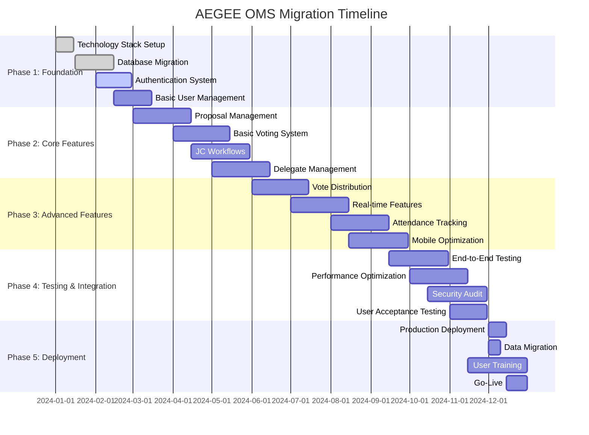

# Migration Guide for AEGEE OMS Rewrite

## Overview

This migration guide provides a comprehensive roadmap for rewriting the AEGEE Online Membership System from the current PHP-based monolithic architecture to a modern microservices-based platform. The guide addresses the transition to a two-service architecture (Proposals and Votings), data migration, feature parity, and organizational change management.

## Target Architecture: Microservices Approach

### Service-Based Migration Strategy

The migration will transition from a monolithic system to a **5-microservice architecture**:

1. **Core Service (Existing)**: Authentication, authorization, user management, audit logging
2. **Statutory Service (Existing)**: Agora management, delegate registration, attendance tracking
3. **Proposals Service (New)**: CIA management, proposal workflow, amendments
4. **Votings Service (New)**: All voting types, vote counting, result calculation
5. **Frontend Service (Existing)**: User interface, real-time updates, accessibility

### Migration Benefits

- **Independent Scaling**: Services can scale based on individual demand
- **Technology Flexibility**: Each service can use optimal technology stack
- **Team Autonomy**: Development teams can work independently on services
- **Fault Isolation**: Failure in one service doesn't bring down the entire system
- **Gradual Migration**: Services can be migrated and deployed independently

## Current System Analysis

### Technical Debt Assessment

#### Architecture Issues

- **Monolithic Structure**: Single codebase with tight coupling
- **Legacy PHP**: PHP 5.x with procedural programming mixed with basic OOP
- **Direct Database Access**: No ORM, raw SQL queries throughout
- **No Testing**: Minimal or no automated testing
- **Security Concerns**: Outdated security practices
- **Performance Limitations**: No caching, inefficient queries

#### Code Quality Issues

- **Mixed Programming Paradigms**: Procedural and OOP code mixed inconsistently
- **Global State**: Heavy reliance on global variables and sessions
- **Hardcoded Values**: Configuration and business rules embedded in code
- **Limited Error Handling**: Basic error handling with user-unfriendly messages
- **Documentation Gap**: Minimal code documentation and API documentation

#### Operational Challenges

- **Single Point of Failure**: Monolithic deployment
- **Scaling Limitations**: Vertical scaling only
- **Maintenance Difficulty**: Changes require full system deployment
- **Monitoring Gap**: Limited monitoring and observability
- **Backup Complexity**: Full system backup required for any component

### System Dependencies

#### External Integrations

- **AEGEE Database**: Member and antenna information
- **Barcode Scanners**: Hardware integration for attendance
- **Email Systems**: Notification and communication
- **File Storage**: Document and media storage

#### Data Dependencies

- **Historical Data**: Years of voting records and constitutional history
- **User Accounts**: Existing user authentication and profiles
- **Organizational Data**: Antenna information and voting rights
- **Configuration Data**: System settings and business rules

## Migration Strategy

### 1. Microservices Phased Migration Approach

#### Phase 1: Infrastructure and Existing Services (Months 1-3)

**Objective**: Establish microservices foundation and enhance existing services

**Deliverables**:

- API Gateway and service discovery setup
- Event bus and messaging infrastructure (Kafka/RabbitMQ)
- Enhanced Core Service with JWT authentication
- Enhanced Statutory Service with event publishing
- Enhanced Frontend Service with WebSocket management
- Database migration to PostgreSQL
- Monitoring and logging infrastructure
- CI/CD pipelines for microservices

**Success Criteria**:

- Microservices infrastructure operational
- Existing services enhanced and event-enabled
- Database migration completed with data integrity verified
- Inter-service communication established
- Real-time capabilities functional

#### Phase 2: Proposals Service (Months 4-6)

**Objective**: Implement Proposals microservice with full functionality

**Deliverables**:

- Proposals service implementation
- CIA document management system
- Proposal workflow and state management
- Amendment tracking and management
- JC review and approval processes
- Document versioning and history
- Integration with shared services

**Success Criteria**:

- Complete proposal lifecycle functional
- CIA management operational
- JC workflows integrated
- Real-time notifications working
- Integration with existing services completed
- Event-driven architecture operational

#### Phase 3: Votings Service (Months 7-9)

**Objective**: Implement Votings microservice with all voting types

**Deliverables**:

- Votings service implementation
- Vote allocation and distribution algorithms
- Multiple voting methods (simple, Schulze, ranked)
- Real-time vote counting and results
- Vote redistribution algorithms
- Integration with Proposals and Statutory services
- Event-driven communication for attendance updates

**Success Criteria**:

- All voting types functional
- Complex vote algorithms working
- Real-time voting experience
- Attendance integration with Statutory service operational
- Cross-service integration complete
- Advanced voting types (ranked, elections, polls)
- Real-time attendance tracking
- Comprehensive reporting and analytics
- Mobile-optimized interfaces

**Success Criteria**:

- All voting types fully functional
- Vote distribution algorithms validated
- Attendance tracking integrated
- Performance requirements met

#### Phase 4: Integration and Testing (Months 10-11)

**Objective**: Full integration testing and production preparation

**Deliverables**:

- End-to-end testing completion
- Performance optimization
- Security audit and penetration testing
- User acceptance testing
- Production deployment preparation

**Success Criteria**:

- All features tested and validated
- Performance benchmarks met
- Security requirements satisfied
- User training completed

#### Phase 5: Deployment and Transition (Month 12)

**Objective**: Production deployment and complete system transition

**Deliverables**:

- Production system deployment
- Data migration completion
- User training and documentation
- Legacy system decommissioning
- Post-deployment support

**Success Criteria**:

- New system operational in production
- All users successfully transitioned
- Legacy system safely decommissioned
- Support processes established

### 2. Technology Stack Selection

#### Backend Framework Options

##### Option 1: Node.js + Express + TypeScript

```javascript
// Example API structure
import express from "express";
import { ProposalController } from "./controllers/ProposalController";
import { authMiddleware } from "./middleware/auth";

const app = express();

app.use("/api/proposals", authMiddleware, ProposalController);

// Vote distribution algorithm implementation
class VoteDistributor {
  static distributeVotes(totalVotes: number, delegates: number): number[] {
    const baseVotes = Math.floor(totalVotes / delegates);
    const extraVotes = totalVotes % delegates;

    const distribution = new Array(delegates).fill(baseVotes);
    for (let i = 0; i < extraVotes; i++) {
      distribution[i]++;
    }

    return distribution;
  }
}
```

**Pros**:

- JavaScript throughout stack
- Large ecosystem and community
- Good for real-time features
- Excellent performance for I/O operations

**Cons**:

- Dynamic typing challenges (mitigated by TypeScript)
- Callback complexity (mitigated by async/await)
- CPU-intensive operations limitations

##### Option 2: Python + Django/FastAPI

```python
# Django models example
from django.db import models
from django.contrib.auth.models import User

class Proposal(models.Model):
    title = models.CharField(max_length=255)
    submitter = models.ForeignKey(User, on_delete=models.CASCADE)
    agora = models.ForeignKey(Agora, on_delete=models.CASCADE)
    status = models.CharField(max_length=32, choices=STATUS_CHOICES)
    created_at = models.DateTimeField(auto_now_add=True)

# Vote distribution algorithm
def distribute_votes(total_votes: int, num_delegates: int) -> List[int]:
    base_votes = total_votes // num_delegates
    extra_votes = total_votes % num_delegates

    distribution = [base_votes] * num_delegates
    for i in range(extra_votes):
        distribution[i] += 1

    return distribution
```

**Pros**:

- Rapid development
- Excellent ORM and admin interface
- Strong security framework
- Great for data analysis and reporting

**Cons**:

- Performance limitations for high concurrency
- GIL limitations for CPU-bound tasks
- Larger memory footprint

##### Option 3: Java + Spring Boot

```java
// Entity example
@Entity
@Table(name = "proposals")
public class Proposal {
    @Id
    @GeneratedValue(strategy = GenerationType.IDENTITY)
    private Long id;

    @Column(nullable = false)
    private String title;

    @ManyToOne
    @JoinColumn(name = "submitter_id")
    private User submitter;

    // Vote distribution service
    @Service
    public class VoteDistributionService {
        public List<Integer> distributeVotes(int totalVotes, int numDelegates) {
            int baseVotes = totalVotes / numDelegates;
            int extraVotes = totalVotes % numDelegates;

            List<Integer> distribution = new ArrayList<>();
            for (int i = 0; i < numDelegates; i++) {
                distribution.add(baseVotes + (i < extraVotes ? 1 : 0));
            }

            return distribution;
        }
    }
}
```

**Pros**:

- Enterprise-grade performance and reliability
- Strong typing and tooling
- Excellent for complex business logic
- Mature ecosystem

**Cons**:

- Longer development time
- Higher resource requirements
- Steeper learning curve

#### Recommended Technology Stack

**Backend**: Node.js + Express + TypeScript

- Balance of productivity and performance
- Excellent for real-time features required for voting
- Strong ecosystem for web applications
- Easy transition for developers

**Database**: PostgreSQL

- Advanced features for complex queries
- JSON support for flexible data structures
- Excellent performance and reliability
- Strong ACID compliance for voting integrity

**Frontend**: React + TypeScript

- Component-based architecture
- Strong ecosystem and community
- Excellent for complex interactive interfaces
- Good mobile support with React Native potential

**Infrastructure**: Docker + Kubernetes

- Containerized deployment
- Horizontal scaling capabilities
- Cloud-agnostic deployment
- Microservices support

### 3. Data Migration Strategy

#### Data Assessment and Mapping

##### Current Database Analysis

```sql
-- Analyze current data volumes
SELECT
    table_name,
    table_rows,
    ROUND(((data_length + index_length) / 1024 / 1024), 2) AS 'Size (MB)'
FROM information_schema.tables
WHERE table_schema = 'jc_database'
ORDER BY table_rows DESC;

-- Identify data quality issues
SELECT
    COUNT(*) as total_proposals,
    COUNT(CASE WHEN title IS NULL OR title = '' THEN 1 END) as missing_titles,
    COUNT(CASE WHEN status NOT IN ('Draft', 'Submitted', 'Approved') THEN 1 END) as invalid_status
FROM proposals;
```

##### Data Mapping Strategy

```typescript
// Data transformation interfaces
interface LegacyProposal {
  id: number;
  uid: string;
  title: string;
  status: string;
  submit_date: string;
  // ... other legacy fields
}

interface ModernProposal {
  id: string;
  submitterId: string;
  title: string;
  status: ProposalStatus;
  submittedAt: Date;
  // ... other modern fields
}

// Migration service
class DataMigrationService {
  async migrateProposals(): Promise<void> {
    const legacyProposals = await this.legacyDb.query<LegacyProposal>(`
            SELECT * FROM proposals ORDER BY id
        `);

    for (const legacy of legacyProposals) {
      const modern: ModernProposal = {
        id: uuidv4(),
        submitterId: await this.mapUserId(legacy.uid),
        title: legacy.title,
        status: this.mapStatus(legacy.status),
        submittedAt: new Date(legacy.submit_date),
        // ... other mappings
      };

      await this.modernDb.proposals.create(modern);
    }
  }
}
```

#### Migration Process

##### 1. Data Extraction

```bash
#!/bin/bash
# Extract legacy data
mysqldump --single-transaction --routines --triggers jc_database > legacy_backup.sql

# Export specific tables for analysis
mysql -e "SELECT * FROM proposals" jc_database > proposals_export.csv
mysql -e "SELECT * FROM votes" jc_database > votes_export.csv
```

##### 2. Data Transformation

```typescript
class DataTransformer {
  // Clean and validate data
  cleanProposalData(legacy: LegacyProposal): ModernProposal {
    return {
      id: this.generateId(),
      title: this.sanitizeText(legacy.title),
      submitterId: this.mapUserId(legacy.uid),
      status: this.validateStatus(legacy.status),
      submittedAt: this.parseDate(legacy.submit_date),
      // Apply business rules and validation
    };
  }

  // Handle data inconsistencies
  validateAndRepair(data: any): any {
    // Implement data validation and repair logic
    // Handle missing references
    // Normalize inconsistent data
    // Apply business rule corrections
  }
}
```

##### 3. Data Validation

```typescript
class MigrationValidator {
  async validateMigration(): Promise<ValidationReport> {
    const report = new ValidationReport();

    // Count validation
    const legacyCount = await this.legacyDb.proposals.count();
    const modernCount = await this.modernDb.proposals.count();
    report.addCheck("Proposal Count", legacyCount === modernCount);

    // Data integrity validation
    const sampleProposals = await this.modernDb.proposals.findMany({
      take: 100,
    });
    for (const proposal of sampleProposals) {
      const legacy = await this.legacyDb.findProposalById(proposal.legacyId);
      report.addCheck(
        `Proposal ${proposal.id}`,
        this.compareProposals(legacy, proposal)
      );
    }

    return report;
  }
}
```

### 4. Feature Parity Matrix

#### Core Features Comparison

| Feature             | Legacy System          | New System            | Migration Complexity |
| ------------------- | ---------------------- | --------------------- | -------------------- |
| User Authentication | PHP Sessions           | JWT + OAuth2          | Medium               |
| Proposal Submission | Multi-page forms       | SPA with validation   | Low                  |
| Vote Casting        | Page refresh           | Real-time updates     | High                 |
| Vote Distribution   | PHP algorithms         | TypeScript algorithms | High                 |
| JC Review           | Basic forms            | Workflow engine       | Medium               |
| Attendance Tracking | Barcode integration    | Multi-modal tracking  | Medium               |
| Reporting           | Server-side generation | Dynamic dashboards    | High                 |
| Mobile Support      | None                   | Progressive Web App   | High                 |

#### Feature Enhancement Opportunities

##### Real-time Capabilities

```typescript
// WebSocket implementation for real-time voting
class VotingWebSocketHandler {
  async handleVoteUpdate(vote: Vote): Promise<void> {
    // Update vote counts in real-time
    const results = await this.calculateResults(vote.proposalId);

    // Broadcast to all connected clients
    this.io.to(`proposal-${vote.proposalId}`).emit("voteUpdate", {
      proposalId: vote.proposalId,
      results: results,
      timestamp: new Date(),
    });
  }

  async handleQuorumUpdate(plenary: Plenary): Promise<void> {
    const quorumStatus = await this.calculateQuorum(plenary.id);

    this.io.to(`plenary-${plenary.id}`).emit("quorumUpdate", quorumStatus);
  }
}
```

##### Enhanced Security

```typescript
// Multi-factor authentication
class AuthenticationService {
  async authenticateWithMFA(
    username: string,
    password: string,
    mfaToken: string
  ): Promise<AuthResult> {
    // Validate primary credentials
    const user = await this.validateCredentials(username, password);
    if (!user) throw new AuthenticationError("Invalid credentials");

    // Validate MFA token
    const mfaValid = await this.validateMFAToken(user.id, mfaToken);
    if (!mfaValid) throw new AuthenticationError("Invalid MFA token");

    // Generate secure session
    const session = await this.createSecureSession(user);

    return {
      user,
      session,
      permissions: await this.getUserPermissions(user.id),
    };
  }
}
```

### 5. Testing Strategy

#### Test Pyramid Implementation

##### Unit Tests

```typescript
// Vote distribution algorithm tests
describe("VoteDistributionService", () => {
  it("should distribute votes equally when possible", () => {
    const result = VoteDistributionService.distributeVotes(6, 3);
    expect(result).toEqual([2, 2, 2]);
  });

  it("should handle remainder votes correctly", () => {
    const result = VoteDistributionService.distributeVotes(7, 3);
    expect(result.sort()).toEqual([2, 2, 3]);
    expect(Math.max(...result) - Math.min(...result)).toBeLessThanOrEqual(1);
  });
});
```

##### Integration Tests

```typescript
// API integration tests
describe("Proposal API", () => {
  it("should create proposal with valid data", async () => {
    const proposalData = {
      title: "Test Proposal",
      motivation: "Test motivation",
      submitterId: "user-123",
    };

    const response = await request(app)
      .post("/api/proposals")
      .send(proposalData)
      .expect(201);

    expect(response.body.id).toBeDefined();
    expect(response.body.status).toBe("Draft");
  });
});
```

##### End-to-End Tests

```typescript
// Playwright E2E tests
test("Complete voting workflow", async ({ page }) => {
  // Login as delegate
  await page.goto("/login");
  await page.fill("[data-testid=username]", "delegate@test.com");
  await page.fill("[data-testid=password]", "password");
  await page.click("[data-testid=submit]");

  // Navigate to voting page
  await page.click("[data-testid=active-votes]");
  await page.click("[data-testid=proposal-123]");

  // Cast vote
  await page.click("[data-testid=vote-for]");
  await page.click("[data-testid=confirm-vote]");

  // Verify confirmation
  await expect(page.locator("[data-testid=vote-confirmed]")).toBeVisible();
});
```

### 6. Risk Mitigation

#### Technical Risks

##### Data Loss Prevention

```typescript
// Comprehensive backup strategy
class BackupService {
  async createPreMigrationBackup(): Promise<BackupResult> {
    const timestamp = new Date().toISOString();

    // Database backup
    const dbBackup = await this.createDatabaseBackup(
      `pre-migration-${timestamp}`
    );

    // File system backup
    const fileBackup = await this.createFileSystemBackup(`files-${timestamp}`);

    // Verification
    const verification = await this.verifyBackups([dbBackup, fileBackup]);

    return { dbBackup, fileBackup, verification, timestamp };
  }
}
```

##### Rollback Strategy

```bash
#!/bin/bash
# Automated rollback script
rollback_migration() {
    echo "Starting rollback process..."

    # Stop new system
    kubectl scale deployment aegee-oms --replicas=0

    # Restore legacy system
    kubectl scale deployment aegee-oms-legacy --replicas=3

    # Restore database
    mysql jc_database < rollback_backup.sql

    # Update DNS to point to legacy system
    kubectl patch service aegee-oms-service -p '{"spec":{"selector":{"app":"aegee-oms-legacy"}}}'

    echo "Rollback completed"
}
```

#### Organizational Risks

##### User Training Program

```markdown
# Training Plan

## Phase 1: JC Member Training (Week 1-2)

- System overview and architecture
- Administrative functions training
- Proposal management workflows
- Emergency procedures

## Phase 2: Delegate Training (Week 3-4)

- User interface familiarization
- Voting process training
- Mobile application usage
- Troubleshooting common issues

## Phase 3: Support Team Training (Week 5-6)

- Technical support procedures
- User assistance protocols
- System monitoring and alerts
- Escalation procedures
```

##### Change Management Strategy

1. **Stakeholder Communication**: Regular updates to all user groups
2. **Pilot Testing**: Limited rollout to selected antennae first
3. **Feedback Integration**: Continuous feedback collection and system improvements
4. **Support Infrastructure**: 24/7 support during critical periods

### 7. Performance Requirements

#### Scalability Targets

- **Concurrent Users**: 1,000+ simultaneous active users
- **Vote Processing**: 100+ votes per second
- **Response Time**: <2 seconds for all user interactions
- **Availability**: 99.9% uptime during Agora periods

#### Performance Testing

```typescript
// Load testing with Artillery
module.exports = {
  config: {
    target: "https://oms.aegee.org",
    phases: [
      { duration: 60, arrivalRate: 10 },
      { duration: 300, arrivalRate: 50 },
      { duration: 60, arrivalRate: 100 },
    ],
  },
  scenarios: [
    {
      name: "Vote casting load test",
      weight: 70,
      flow: [
        {
          post: {
            url: "/api/auth/login",
            json: { username: "{{ username }}", password: "{{ password }}" },
          },
        },
        {
          post: {
            url: "/api/votes",
            json: { proposalId: "{{ proposalId }}", choice: "For" },
          },
        },
      ],
    },
  ],
};
```

### 8. Timeline and Milestones

#### Detailed Project Timeline



#### Critical Milestones

1. **Database Migration Complete** (Month 2)

   - All legacy data successfully migrated
   - Data integrity validation passed
   - Rollback procedures tested

2. **Core Voting Functionality** (Month 5)

   - Basic voting system operational
   - Vote distribution algorithm implemented
   - Integration testing completed

3. **Feature Parity Achieved** (Month 9)

   - All legacy features replicated
   - Performance benchmarks met
   - Security requirements satisfied

4. **Production Ready** (Month 11)

   - Full testing completed
   - Security audit passed
   - User training program completed

5. **Go-Live Success** (Month 12)
   - New system operational in production
   - All users successfully transitioned
   - Legacy system decommissioned

This comprehensive migration guide provides the framework for successfully transitioning from the legacy AEGEE OMS to a modern, scalable platform while minimizing risk and ensuring continuity of democratic processes.
