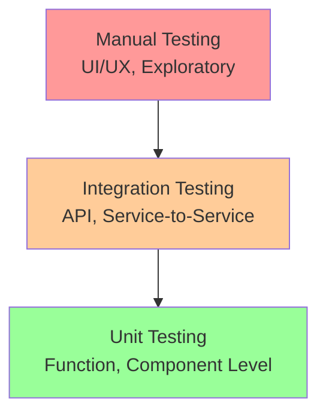

# Quality Assurance Standards Template

## Quality Framework Overview

This document establishes the quality standards and processes for system development projects. It ensures consistent quality across all deliverables and provides clear criteria for success.

## Definition of Done

### Feature Level Definition of Done

A feature is considered "Done" when ALL of the following criteria are met:

#### Functional Criteria

- [ ] All acceptance criteria from user stories are met
- [ ] Feature works as specified in requirements documentation
- [ ] All edge cases and error scenarios are handled
- [ ] Feature integrates properly with existing system components
- [ ] Data validation rules are implemented and tested

#### Code Quality Criteria

- [ ] Code follows established coding standards and conventions
- [ ] Code is peer-reviewed and approved by at least one other developer
- [ ] Code coverage meets minimum threshold (80% for critical paths)
- [ ] No critical or high-priority static analysis warnings
- [ ] All TODO comments are resolved or tracked as future work

#### Testing Criteria

- [ ] Unit tests written and passing (minimum 80% coverage)
- [ ] Integration tests written and passing
- [ ] Manual testing completed and documented
- [ ] Performance testing meets established benchmarks
- [ ] Security testing completed (if applicable)

#### Documentation Criteria

- [ ] Code is properly commented and self-documenting
- [ ] API documentation updated (if applicable)
- [ ] User documentation updated (if user-facing)
- [ ] Technical documentation updated
- [ ] Change log updated with feature description

#### SME Validation Criteria

- [ ] Feature demonstrated to relevant SMEs
- [ ] SME feedback incorporated or documented as future work
- [ ] Business process validation completed
- [ ] CIA compliance verified (where applicable)

### Sprint Level Definition of Done

A sprint is considered "Done" when:

- [ ] All planned features meet Feature Level Definition of Done
- [ ] Sprint demo successfully presented to stakeholders
- [ ] Retrospective completed and improvements identified
- [ ] Next sprint planning completed based on current progress
- [ ] Risk register updated with any new issues identified

### Release Level Definition of Done

A release is considered "Done" when:

- [ ] All Must Have features completed and validated
- [ ] System integration testing passed
- [ ] Performance benchmarks met
- [ ] Security scan completed with no critical issues
- [ ] User acceptance testing completed and signed off
- [ ] Production deployment plan validated
- [ ] Rollback procedures tested and documented
- [ ] Training materials completed and delivered

## Testing Strategy

### Testing Pyramid Structure



### Unit Testing Standards

#### Coverage Requirements

- **Minimum Coverage**: 80% overall code coverage
- **Critical Path Coverage**: 95% for business-critical functionality
- **New Code Coverage**: 90% for all new code additions

#### Testing Guidelines

- **Test Naming**: Use descriptive names that explain the scenario
- **Test Structure**: Follow Arrange-Act-Assert pattern
- **Test Independence**: Each test should be independent and repeatable
- **Test Data**: Use meaningful test data that reflects real-world scenarios

#### Example Test Structure

```javascript
describe("ProposalVoting", () => {
  describe("when casting a vote", () => {
    it("should record valid vote for authorized delegate", () => {
      // Arrange
      const delegate = createAuthorizedDelegate();
      const proposal = createActiveProposal();
      const vote = "FOR";

      // Act
      const result = proposalVoting.castVote(delegate, proposal, vote);

      // Assert
      expect(result.success).toBe(true);
      expect(result.vote).toBe("FOR");
      expect(result.timestamp).toBeDefined();
    });
  });
});
```

### Integration Testing Standards

#### API Testing

- **Response Validation**: Verify all API responses match documented schemas
- **Error Handling**: Test all error scenarios and HTTP status codes
- **Authentication**: Validate security and authorization for all endpoints
- **Data Integrity**: Ensure data consistency across service boundaries

#### Service Integration Testing

- **Microservice Communication**: Test all inter-service communication
- **Data Synchronization**: Validate data consistency across services
- **Failure Scenarios**: Test behavior when dependent services are unavailable
- **Performance**: Measure response times under normal and peak loads

### User Acceptance Testing (UAT)

#### UAT Process

1. **UAT Planning**: Define test scenarios with SMEs
2. **Test Environment Setup**: Configure realistic test environment
3. **Test Execution**: SMEs execute predefined test scenarios
4. **Defect Management**: Track and resolve issues found during UAT
5. **Sign-off**: Formal acceptance from SMEs

#### UAT Criteria

- **Functional Validation**: All business processes work as expected
- **Usability Validation**: Interface is intuitive and meets user needs
- **Performance Validation**: System performs adequately under realistic load
- **Data Validation**: Data accuracy and completeness verified

## Performance Benchmarks

### Response Time Standards

| Operation Type    | Target Response Time | Maximum Acceptable |
| ----------------- | -------------------- | ------------------ |
| Page Load         | < 2 seconds          | < 4 seconds        |
| API Calls         | < 500ms              | < 1 second         |
| Database Queries  | < 200ms              | < 500ms            |
| File Uploads      | < 5 seconds          | < 10 seconds       |
| Report Generation | < 10 seconds         | < 30 seconds       |

### Throughput Standards

| System Function       | Target Throughput | Maximum Load |
| --------------------- | ----------------- | ------------ |
| Concurrent Users      | 500 users         | 1000 users   |
| Votes per Minute      | 1000 votes        | 2000 votes   |
| Page Views per Second | 50 requests       | 100 requests |
| API Calls per Second  | 200 requests      | 500 requests |

### Resource Utilization Standards

| Resource          | Normal Operation | Peak Operation | Alert Threshold |
| ----------------- | ---------------- | -------------- | --------------- |
| CPU Usage         | < 70%            | < 90%          | > 85%           |
| Memory Usage      | < 80%            | < 95%          | > 90%           |
| Disk I/O          | < 60%            | < 80%          | > 75%           |
| Network Bandwidth | < 50%            | < 70%          | > 65%           |

## Accessibility Standards

### WCAG 2.1 Compliance

#### Level AA Requirements (Minimum)

- [ ] **Perceivable**: All content accessible via screen readers
- [ ] **Operable**: All functionality accessible via keyboard
- [ ] **Understandable**: Clear navigation and instructions
- [ ] **Robust**: Compatible with assistive technologies

#### Specific Requirements

- **Color Contrast**: Minimum 4.5:1 ratio for normal text, 3:1 for large text
- **Keyboard Navigation**: All interactive elements accessible via keyboard
- **Alt Text**: All images have descriptive alternative text
- **Form Labels**: All form inputs have clear, associated labels
- **Focus Indicators**: Clear visual indicators for keyboard focus
- **Semantic HTML**: Proper use of HTML elements for structure and meaning

### Testing Tools

- **Automated Testing**: Use tools like axe-core for automated accessibility testing
- **Manual Testing**: Navigate entire application using only keyboard
- **Screen Reader Testing**: Test with popular screen readers (NVDA, JAWS, VoiceOver)
- **Color Blindness Testing**: Verify interface works for color-blind users

## Security Standards

### Security Testing Requirements

#### Authentication Testing

- [ ] Password policy enforcement
- [ ] Account lockout mechanisms
- [ ] Session timeout validation
- [ ] Multi-factor authentication (if implemented)

#### Authorization Testing

- [ ] Role-based access control validation
- [ ] Privilege escalation prevention
- [ ] Data access restrictions by user role
- [ ] API endpoint authorization checks

#### Data Protection Testing

- [ ] Input validation and sanitization
- [ ] SQL injection prevention
- [ ] Cross-site scripting (XSS) prevention
- [ ] Data encryption in transit and at rest

#### Infrastructure Security

- [ ] Secure communication protocols (HTTPS)
- [ ] Server configuration security
- [ ] Database security configurations
- [ ] Backup and recovery security

### Security Scanning

#### Automated Security Scans

- **Frequency**: Weekly during development, daily before release
- **Tools**: OWASP ZAP, SonarQube Security, Snyk
- **Scope**: All application components and dependencies
- **Reporting**: Security scan reports reviewed by technical lead

#### Manual Security Reviews

- **Code Reviews**: Security-focused code review for critical components
- **Architecture Reviews**: Security assessment of system architecture
- **Penetration Testing**: Professional security testing before major releases

## Code Quality Standards

### Coding Conventions

#### JavaScript/Node.js Standards

- **Linting**: ESLint with agreed-upon rule set
- **Formatting**: Prettier for consistent code formatting
- **Naming**: camelCase for variables/functions, PascalCase for classes
- **Comments**: JSDoc comments for all public functions and classes

#### Database Standards

- **Naming**: snake_case for table and column names
- **Migrations**: All schema changes via versioned migrations
- **Indexing**: Appropriate indexes for query performance
- **Constraints**: Foreign key and check constraints where applicable

### Code Review Process

#### Review Requirements

- **Mandatory Reviews**: All code changes require peer review
- **Review Criteria**: Functionality, security, performance, maintainability
- **Review Timeline**: Reviews completed within 24 hours
- **Approval**: At least one approval required, two for critical changes

#### Review Checklist

- [ ] Code follows established conventions and standards
- [ ] Logic is clear and well-documented
- [ ] Error handling is appropriate and comprehensive
- [ ] Security considerations are addressed
- [ ] Performance implications are considered
- [ ] Tests are adequate and meaningful

## Continuous Integration/Continuous Deployment (CI/CD)

### Build Pipeline Standards

#### Automated Checks

- [ ] Code compilation successful
- [ ] All unit tests passing
- [ ] Code coverage meets threshold
- [ ] Static analysis checks pass
- [ ] Security scans complete without critical issues
- [ ] Integration tests pass

#### Deployment Gates

- [ ] Automated testing suite passes
- [ ] Manual QA sign-off (for production)
- [ ] Security clearance (for production)
- [ ] Performance benchmarks met
- [ ] SME approval (for major releases)

### Environment Standards

#### Development Environment

- **Purpose**: Individual developer testing
- **Deployment**: Automatic on code commit
- **Data**: Synthetic test data
- **Access**: Development team only

#### Staging Environment

- **Purpose**: Integration testing and SME validation
- **Deployment**: Automatic after successful development testing
- **Data**: Production-like test data (anonymized)
- **Access**: Development team and SMEs

#### Production Environment

- **Purpose**: Live system for end users
- **Deployment**: Manual approval required
- **Data**: Live production data
- **Access**: Authorized users only

## Quality Metrics and Monitoring

### Key Quality Indicators (KQIs)

#### Development Metrics

- **Defect Rate**: Number of defects per feature/story point
- **Test Coverage**: Percentage of code covered by automated tests
- **Code Review Coverage**: Percentage of code changes reviewed
- **Build Success Rate**: Percentage of successful automated builds

#### User Experience Metrics

- **User Satisfaction**: Survey scores from UAT and post-deployment
- **Task Completion Rate**: Percentage of users completing intended tasks
- **Error Rate**: Frequency of user-encountered errors
- **Support Tickets**: Number and severity of user-reported issues

#### Performance Metrics

- **Response Times**: Average and 95th percentile response times
- **Uptime**: System availability percentage
- **Throughput**: Requests handled per unit time
- **Resource Utilization**: CPU, memory, and storage usage

### Monitoring and Alerting

#### Real-time Monitoring

- **Application Performance**: Response times, error rates, throughput
- **Infrastructure**: Server health, database performance, network status
- **User Activity**: Login rates, feature usage, error frequencies
- **Security**: Failed login attempts, suspicious activities

#### Alert Thresholds

- **Critical**: System down, security breach, data corruption
- **High**: Performance degradation >50%, error rate >5%
- **Medium**: Performance degradation >25%, error rate >2%
- **Low**: Trends indicating potential future issues

## Quality Review Process

### Regular Quality Reviews

#### Weekly Quality Standup

- **Participants**: Development team, QA lead, Technical lead
- **Duration**: 30 minutes
- **Agenda**: Quality metrics review, issue identification, improvement actions

#### Monthly Quality Assessment

- **Participants**: Full project team including SMEs
- **Duration**: 2 hours
- **Agenda**: Comprehensive quality review, trend analysis, process improvements

#### Release Quality Gate

- **Trigger**: Before each major release
- **Participants**: All stakeholders
- **Process**: Formal quality assessment and sign-off

### Continuous Improvement

#### Quality Improvement Actions

- **Regular Retrospectives**: Identify and address quality issues
- **Process Updates**: Refine quality processes based on lessons learned
- **Tool Evaluation**: Assess and adopt new quality tools and techniques
- **Training**: Ongoing quality training for team members

#### Success Criteria

- **Defect Reduction**: 10% reduction in defects per release
- **Performance Improvement**: 5% improvement in key performance metrics
- **User Satisfaction**: Maintain >90% user satisfaction scores
- **Process Efficiency**: Reduce quality-related rework by 15%
