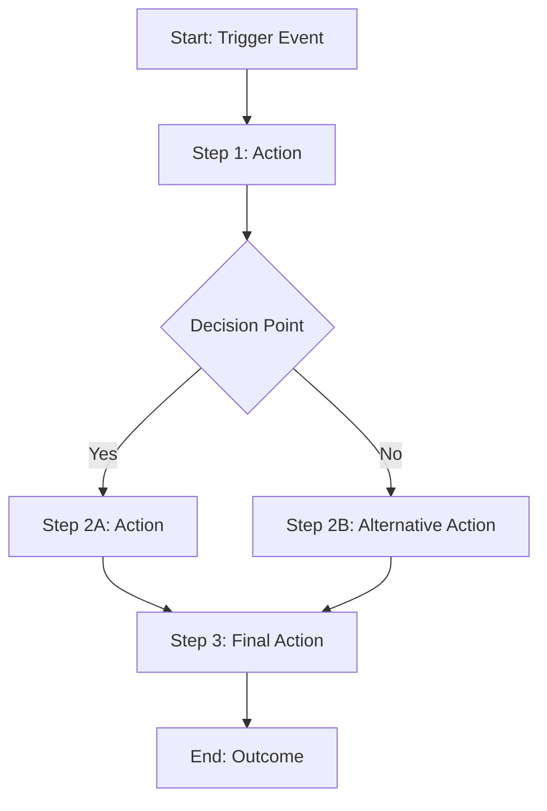
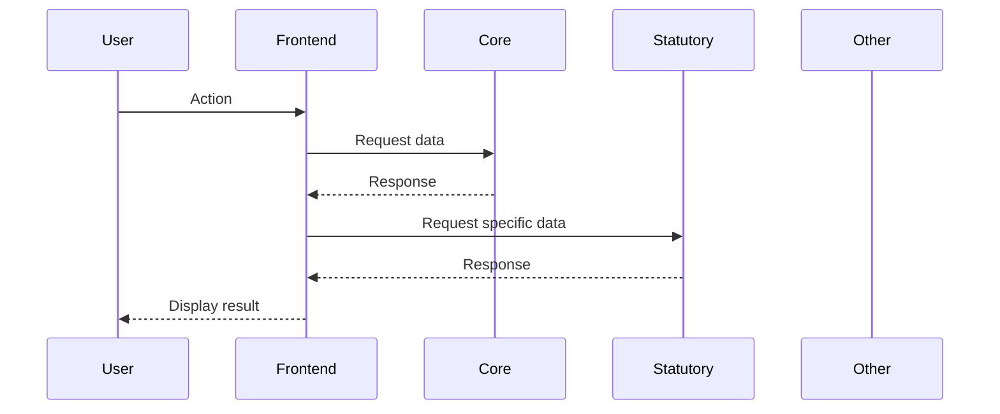

# Requirements Documentation Template

## Project Information

**Project Name**: [System/Module Name]
**Version**: [Document Version]
**Date**: [Creation/Update Date]
**Authors**: [Documentation Team]
**Reviewers**: [SME Names]
**Approval Date**: [SME Sign-off Date]

## Table of Contents

1. [Business Context](#business-context)
2. [Functional Requirements](#functional-requirements)
3. [User Stories and Personas](#user-stories-and-personas)
4. [Process Workflows](#process-workflows)
5. [User Interface Specifications](#user-interface-specifications)
6. [Data Requirements](#data-requirements)
7. [Integration Requirements](#integration-requirements)
8. [MoSCoW Prioritization](#moscow-prioritization)
9. [CIA References](#cia-references)
10. [Acceptance Criteria](#acceptance-criteria)

## Business Context

### Purpose Statement

[Describe the business purpose of this system/feature]

### Scope

[Define what is and isn't included in this project]

### Success Criteria

[How will success be measured?]

### Stakeholders

[List all affected parties and their interests]

## Functional Requirements

### Overview

[High-level description of system functionality]

### Core Functions

#### Function 1: [Function Name]

- **Description**: [What this function does]
- **Business Value**: [Why this is important]
- **CIA Reference**: [Reference to relevant CIA sections]
- **Microservice**: [Which microservice handles this - core/statutory/events/etc.]
- **Data Exchange**: [What data flows to/from core/statutory]
- **Priority**: [Must/Should/Could/Won't]

#### Function 2: [Function Name]

- **Description**: [What this function does]
- **Business Value**: [Why this is important]
- **CIA Reference**: [Reference to relevant CIA sections]
- **Microservice**: [Which microservice handles this]
- **Data Exchange**: [What data flows to/from other services]
- **Priority**: [Must/Should/Could/Won't]

[Continue for all functions...]

## User Stories and Personas

### Personas

#### Persona 1: [Role Name] (e.g., JC Member)

- **Description**: [Who they are and their role]
- **Goals**: [What they want to achieve]
- **Pain Points**: [Current challenges]
- **Permissions**: [What they can see/do]
- **System Access**: [Which parts of system they use]

#### Persona 2: [Role Name] (e.g., Delegate)

- **Description**: [Who they are and their role]
- **Goals**: [What they want to achieve]
- **Pain Points**: [Current challenges]
- **Permissions**: [What they can see/do]
- **System Access**: [Which parts of system they use]

[Continue for all personas...]

### User Stories

#### Epic: [Epic Name]

**Story 1**: [Story Title]

- **As a** [persona]
- **I want** [functionality]
- **So that** [business value]
- **Priority**: [Must/Should/Could/Won't]
- **Acceptance Criteria**:
  - [Specific testable criteria]
  - [Additional criteria]
- **Data Requirements**:
  - **Input**: [What data comes in]
  - **Storage**: [Where data is stored - which microservice]
  - **Output**: [What data goes out]

[Continue for all user stories...]

## Process Workflows

### Workflow 1: [Workflow Name]

**Overview**: [Brief description of the workflow]

**CIA Reference**: [Relevant CIA sections]

**Participants**:

- [Role 1]: [Responsibilities]
- [Role 2]: [Responsibilities]

**Process Steps**:



**Detailed Steps**:

1. **Step 1**: [Action Description]

   - **Actor**: [Who performs this]
   - **System Interaction**: [Which pages/APIs involved]
   - **Data**: [What data is processed]
   - **Validation**: [What validations are required]
   - **Microservice**: [Which service handles this]

2. **Step 2**: [Action Description]
   - **Actor**: [Who performs this]
   - **System Interaction**: [Which pages/APIs involved]
   - **Data**: [What data is processed]
   - **Validation**: [What validations are required]
   - **Microservice**: [Which service handles this]

[Continue for all steps...]

**Exception Handling**:

- **Exception 1**: [What can go wrong and how to handle it]
- **Exception 2**: [What can go wrong and how to handle it]

[Repeat for all workflows...]

## User Interface Specifications

### Page 1: [Page Name]

**Purpose**: [What this page does]
**URL Pattern**: [/path/to/page/:param]
**Permissions**: [Who can access this page]
**Microservice Data Sources**:

- **Core**: [What data requested from core]
- **Statutory**: [What data requested from statutory]
- **Other**: [What data from other services]

**Page Elements**:

#### Header Section

- **Element**: [Navigation, title, etc.]
- **Data Displayed**: [What information is shown]
- **Actions Available**: [What users can do]

#### Main Content

- **Data Tables/Forms**: [Describe tables and forms]
- **Example Data**:
  ```
  [Provide realistic example data to show what will be displayed]
  ```
- **Validation Rules**:
  - [Field 1]: [Validation requirements]
  - [Field 2]: [Validation requirements]

#### Action Buttons

- **Button Name**: [What it does]
- **Permissions**: [Who can use it]
- **Validation**: [What validations before action]

**Mockup/Wireframe**: [Reference to visual design]

[Repeat for all pages...]

## Data Requirements

### Data Entities

#### Entity 1: [Entity Name]

- **Description**: [What this represents]
- **Storage Location**: [Which microservice database]
- **Key Attributes**:
  - [Attribute 1]: [Type, description, validation]
  - [Attribute 2]: [Type, description, validation]
- **Relationships**: [How it connects to other entities]
- **Business Rules**: [Constraints and rules]

[Continue for all entities...]

### Data Flow Diagrams



## Integration Requirements

### Integration 1: [System/Service Name]

- **Purpose**: [Why this integration is needed]
- **Data Exchange**: [What data flows in/out]
- **Frequency**: [How often]
- **Format**: [API, file, etc.]
- **Authentication**: [How systems authenticate]
- **Error Handling**: [What happens when integration fails]

[Continue for all integrations...]

## MoSCoW Prioritization

### Must Have (Release 1)

- [Requirement 1]: [Brief description]
- [Requirement 2]: [Brief description]

### Should Have (Release 2)

- [Requirement 1]: [Brief description]
- [Requirement 2]: [Brief description]

### Could Have (Future releases)

- [Requirement 1]: [Brief description]
- [Requirement 2]: [Brief description]

### Won't Have (This project)

- [Requirement 1]: [Brief description and reason]
- [Requirement 2]: [Brief description and reason]

## CIA References

### Section 1: [CIA Section Reference]

- **Requirement**: [How this system requirement maps to CIA]
- **Implementation**: [How we will ensure compliance]

### Section 2: [CIA Section Reference]

- **Requirement**: [How this system requirement maps to CIA]
- **Implementation**: [How we will ensure compliance]

[Continue for all relevant CIA sections...]

## Acceptance Criteria

### Functional Acceptance

- [ ] All Must Have requirements implemented
- [ ] All user stories completed with acceptance criteria met
- [ ] All workflows tested end-to-end
- [ ] All integration points working

### Quality Acceptance

- [ ] Performance benchmarks met
- [ ] Security requirements satisfied
- [ ] Accessibility standards met
- [ ] Browser compatibility verified

### Business Acceptance

- [ ] SME sign-off on functionality
- [ ] User training materials created
- [ ] Business processes documented
- [ ] CIA compliance verified

## Appendices

### Appendix A: Glossary

[Define technical and business terms]

### Appendix B: References

[Links to related documents, CIA sections, etc.]

### Appendix C: Change Log

| Date   | Version   | Changes       | Author |
| ------ | --------- | ------------- | ------ |
| [Date] | [Version] | [Description] | [Name] |
